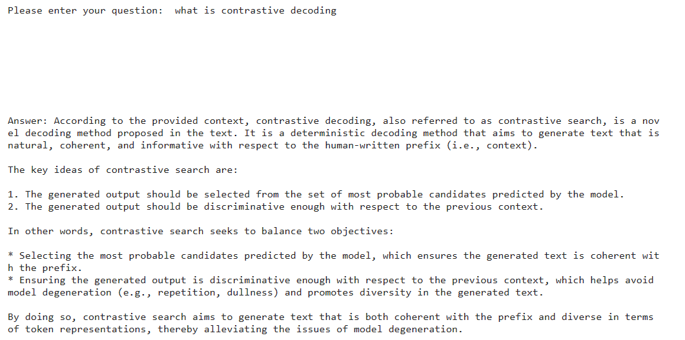

### Simple RAG

This project is the implementation of building a simple RAG

**Model used**: Llama3-70b

**Framework**: Langchain

**Environment**: Kaggle Notebook

Demo: _I did import 4 papers related to "Contrastive Decoding" an tested the model with basic input questions._

> I do recommend users to try to use Ollama instead of Groq and run on the local machine,
in the sense that there would be more available models

Further development: Using chainlit to integrate UI